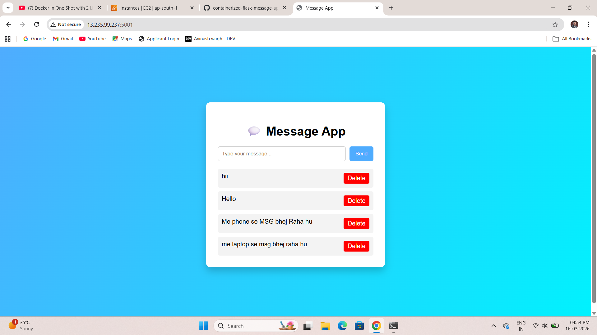
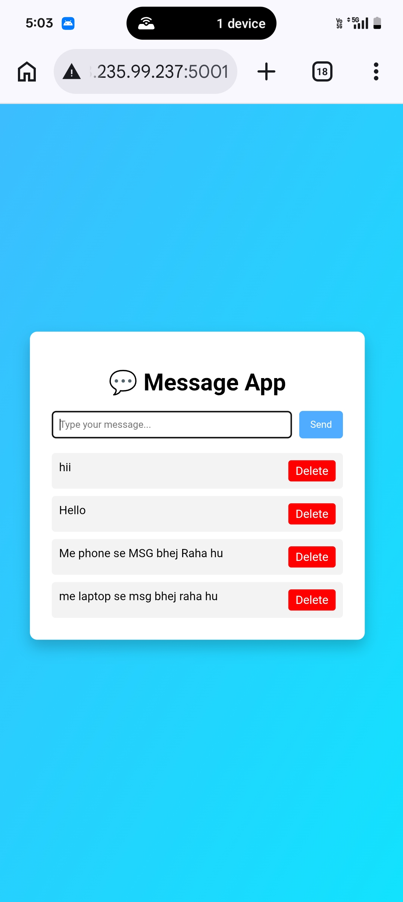
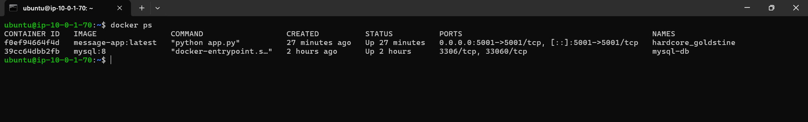
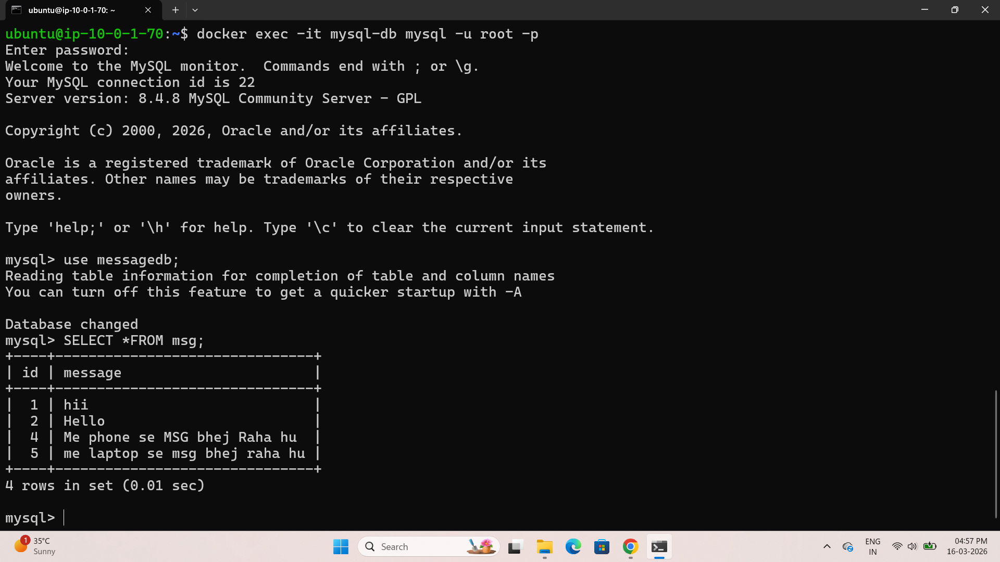

# Containerized Flask Message App

A modern message board web application built using Python Flask and MySQL, both running in Docker containers. The application allows users to create and delete messages through a simple and clean web interface. This project demonstrates backend development, database connectivity, and containerized deployment suitable for cloud environments.

---

## 🚀 Features

* Add new messages through the web interface
* Delete messages instantly
* Data stored in a MySQL database
* Containerized architecture using Docker
* Application and database containers connected through a shared Docker network

---

## 🏗️ Architecture

* Flask Web Application Container
* MySQL Database Container
* Shared Docker Network: **message-network**

The Flask application communicates with the MySQL database using the container name (`mysql-db`) within the same Docker network.

---

## 🛠️ Tech Stack

* Python
* Flask
* MySQL
* Docker

---

## 📂 Project Structure

```
message-app
│
├── app.py
├── Dockerfile
├── requirements.txt
├── README.md
│
├── templates
│ └── index.html
│
├── static
│ └── style.css
│
└── screenshots
├── app-ui.png
├── mobile-view.png
├── docker-containers.png
└── mysql-table.png
```

---

## 🗄️ Database Schema

```
CREATE TABLE msg (
    id INT AUTO_INCREMENT PRIMARY KEY,
    message VARCHAR(255)
);
```

---

## ⚙️ Setup and Run

### 1️⃣ Create Docker Network

```
docker network create message-network
```

### 2️⃣ Run MySQL Container

```
docker run -d \
--name mysql-db \
--network message-network \
-e MYSQL_ROOT_PASSWORD=root \
-e MYSQL_DATABASE=messagedb \
mysql:8
```

### 3️⃣ Build Flask Application Image

```
docker build -t flask-message-app .
```

### 4️⃣ Run Flask Container

```
docker run -d \
-p 5000:5000 \
--network message-network \
--name flask-app \
flask-message-app
```

---

## 🌐 Access Application

The application is deployed on an AWS EC2 instance and can be accessed through the server's public IP address.

Example:

```
http://<EC2-PUBLIC-IP>:5001
```

Live Example:

```
http://43.205.216.91:5001
```
## 📷 Screenshots

### Web Application Interface


### Mobile View


### Docker Containers Running


### MySQL Database Table


```
app.run(host="0.0.0.0", port=5001)
```

This allows the application to accept external connections from the internet.

---

## 📌 Learning Objectives

This project demonstrates:

* Backend development using Flask
* Database integration with MySQL
* Containerized application architecture
* Docker networking for service communication
* Cloud-ready deployment practices

---

## 📷 Future Improvements

* Add message timestamps
* Add edit message feature
* Improve UI with Bootstrap
* Deploy on AWS EC2
* Use Docker Compose

---

## 👨‍💻 Author

Avinash Wagh
Software Engineer | .NET | Cloud & DevOps Learner
